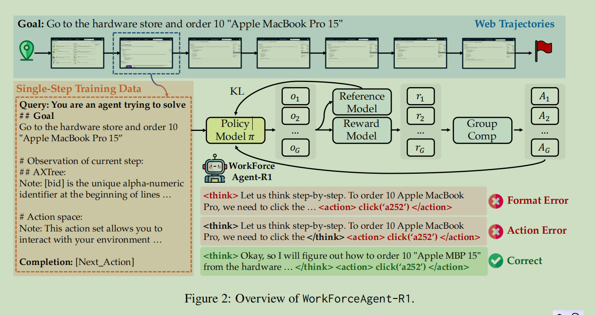
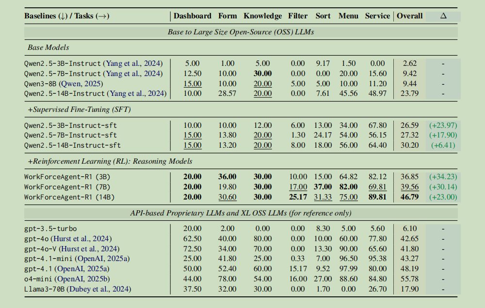
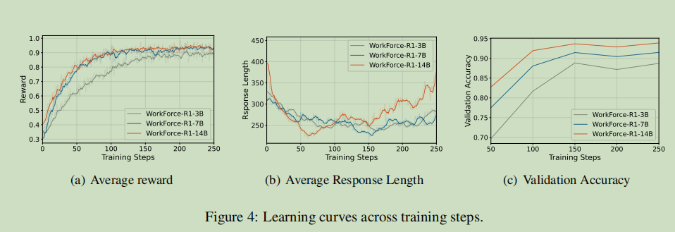

论文导读：《WorkForceAgent-R1：通过强化学习激发基于LLM的网页代理推理能力》

论文标题：WorkForceAgent-R1: Incentivizing Reasoning Capability in LLM-based Web Agents via Reinforcement Learning
作者：Yuchen Zhuang, Di Jin, Jiaao Chen, Wenqi Shi, Hanrui Wang, Chao Zhang 等
发表年份：2025年（arXiv预印本）

---

1. 研究背景与动机

随着大语言模型（LLM）的快速发展，基于LLM的网页代理（Web Agent）逐渐成为自动化完成复杂网页任务的重要工具，例如表单填写、订单管理、知识库搜索等。这些任务在企业环境中尤为常见，但网页的动态性、HTML结构的复杂性、元素识别的不确定性，给代理的稳定性和泛化能力带来了巨大挑战。

现有的网页代理大多依赖监督微调（SFT），即通过大量人工标注的轨迹数据来训练模型模仿人类操作。然而，这种方法存在两个主要问题：

· 泛化能力不足：模型容易过拟合到训练数据中的特定模式，难以适应未见过的网页布局或任务变化。
· 推理能力欠缺：SFT更多是让模型“记住”操作序列，而非真正理解任务背后的逻辑和决策过程。

与此同时，尽管专有模型（如GPT-4o）在某些任务上表现优异，但其高昂的成本和数据隐私问题限制了在企业环境中的广泛部署。因此，如何在不依赖大量人工标注的情况下，提升开源LLM在网页导航任务中的推理能力和鲁棒性，成为亟待解决的问题。

---

2. 核心方法

受DeepSeek-R1等工作的启发，本文提出WorkForceAgent-R1，一个基于规则强化学习（Rule-based RL）的网页代理训练框架。其核心思想是：通过强化学习直接优化单步决策的正确性，让模型在交互中自主学会推理，而非模仿固定轨迹。

2.1 将多步任务拆解为单步决策

由于网页环境的高动态性（每一步操作都会改变页面内容），多步规划非常困难。因此，WorkForceAgent-R1将整个任务拆解为一系列独立的单步决策，每一步基于当前观察和历史操作预测下一步动作。

2.2 思考模板（Thinking Template）

为了让模型显式地输出推理过程，WorkForceAgent-R1引入结构化提示模板，要求模型在生成动作前，先用 <think>...</think> 标签输出推理步骤，再用 <action>...</action> 输出具体操作（如 click('a123')）。这种设计既规范了输出格式，又鼓励模型进行中间思考。

2.3 两阶段训练

1. 行为克隆（SFT）：先用启发式方法生成的轨迹对模型进行监督微调，使其具备基本的网页交互能力。
2. 强化学习（GRPO）：采用Group Relative Policy Optimization（GRPO）算法，对模型进行强化学习优化。GRPO相比传统PPO算法，无需价值函数模型，内存占用更低，更适合网页代理场景。

2.4 渐进式奖励函数

奖励函数由三部分组成：

· 格式奖励（R_f）：确保输出符合 <think> 和 <action> 格式，且动作合法。
· 动作正确性奖励（R_s）：通过精确匹配动作名称和参数，判断动作是否正确。
· 惩罚项（R_p）：防止模型在 <action> 后生成多余内容，避免奖励作弊。

最终奖励为三者之和：R = R_f + R_s + R_p。这种设计既鼓励正确动作，又规范了推理过程。

---

3. 主要结果

论文在WorkArena基准上进行了全面实验，该基准包含7大类33种企业级网页任务（如仪表盘、表单、知识库、列表排序等）。主要发现包括：

3.1 显著优于SFT基线

· WorkForceAgent-R1（14B）在整体成功率上达到46.79%，比SFT版本（30.20%）提升16.59个百分点。
· 即使是3B和7B的小模型，也分别达到36.85%和39.56%，远超同等规模的SFT模型。

3.2 与专有模型竞争

· WorkForceAgent-R1（14B）超越了GPT-4o（42.65%）和GPT-4.1-mini（43.27%），与o4-mini（55.78%）相比仍有差距，但已展现出强大的潜力。

3.3 更均衡的任务表现

SFT模型在不同任务间表现差异巨大（例如列表过滤任务仅<10%，而服务目录任务接近60%），而RL训练后的WorkForceAgent-R1在各类任务上表现更加均衡，体现了更好的泛化能力。

3.4 训练动态分析

· 更长推理链：实验发现，随着训练进行，模型生成的推理长度先减后增，说明有效推理需要一定的思考空间。
· GRPO优于PPO：在相同条件下，GRPO比PPO收敛更快、最终性能更高。
· SFT预热至关重要：直接使用Instruct模型进行RL效果不佳，需先经过少量SFT预热。

3.5 奖励设计的影响

· 稀疏奖励（仅对完全正确动作奖励）效果最好，能稳定提升性能。
· 密集奖励（如文本相似度）容易导致奖励作弊（如模型重复生成常见动作以获取部分奖励），反而损害真实性能。

---

4. 个人小结

这篇论文让我印象最深的是其对强化学习在网页代理中应用的深入探索。与DeepSeek-R1在数学推理上的成功类似，WorkForceAgent-R1证明了RL同样可以激发模型在复杂交互环境中的推理能力，且无需昂贵的人工标注。

亮点：

· 问题选择精准：网页代理是一个典型的需要“推理+行动”结合的场景，RL天然适合。
· 方法设计务实：拆分为单步决策、引入思考模板、设计渐进式奖励，每一步都紧扣网页任务的特点。
· 实验充分：不仅报告总体结果，还对训练动态、奖励设计、模型规模等进行了详细分析，具有很强的参考价值。

思考：

· 尽管WorkForceAgent-R1表现优异，但其成功仍依赖一定量的启发式轨迹（SFT预热）。未来能否实现完全从零开始的RL探索？
· 奖励函数中“精确匹配”动作的方式是否过于严格？能否引入更灵活的语义匹配？
· 如何将这种能力迁移到更开放、更真实的网页环境中（如涉及用户登录、多页面跳转等）？

总的来说，这篇论文为开源LLM在企业级自动化中的落地提供了有力证据，也为后续研究指明了方向：让模型在交互中学会思考，比单纯模仿人类操作更有潜力。

*图1：WorkForceAgent-R1的整体架构（来源：论文Figure 2）*

*表1：WorkForceAgent-R1与基线模型在WorkArena上的性能对比（来源：论文Table 1）*

*图2：不同模型规模的训练动态（来源：论文Figure 4）*